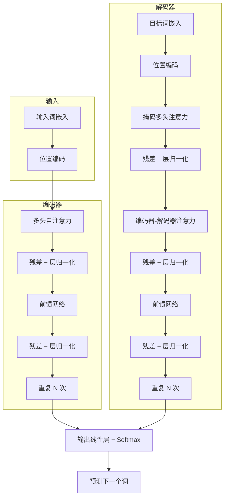

# Transformer

## 概述

> Transformer 是谷歌 2017 年提出的深度学习架构，完全基于自注意力机制，彻底改变了自然语言处理领域，是现代大语言模型的基础架构。

Transformer 解决了 RNN/CNN 无法并行计算序列的问题，通过多头自注意力机制实现了对整个序列的全局建模，成为了当前几乎所有大语言模型的 backbone。

---

## 一、什么是 Transformer

Transformer 是一种基于自注意力机制的序列到序列（seq2seq）架构，由编码器（Encoder）和解码器（Decoder）两部分组成。与传统的循环神经网络（RNN）和卷积神经网络（CNN）不同，Transformer 可以并行处理整个序列，大大提升了训练效率。

核心贡献：**自注意力机制 + 位置编码 + 残差连接 + 层归一化**。

---

## 二、核心结构

Transformer 整体结构如下图所示：

### 2.1 编码器

编码器由 **N 个相同层**堆叠而成，每一层包含两个子层：

1. **多头自注意力层**：每个 token 都能注意到序列中所有其他 token，计算上下文表示
2. **前馈神经网络层**：对每个 token 做独立的非线性变换

每个子层都使用**残差连接** + **层归一化**：

$$
LayerNorm(x + Sublayer(x))
$$

### 2.2 解码器

解码器同样由 N 个相同层堆叠，有三个子层：

1. **掩码多头自注意力**：防止每个位置看到未来的信息（自回归生成）
2. **编码器-解码器注意力**：关注编码器的输出，建立源序列和目标序列的关联
3. **前馈神经网络**：同编码器

### 2.3 自注意力机制

自注意力计算分为三步：

1. **计算 QKV**：$Q = XW_q$, $K = XW_k$, $V = XW_v$
2. **计算注意力分数**：$Attention(Q,K,V) = softmax(\frac{QK^T}{\sqrt{d_k}})V$
3. **多头拼接**：分成多个头分别计算，最后拼接结果

::: tip 关键点
$\frac{1}{\sqrt{d_k}}$ 是缩放因子，防止点积结果过大导致 softmax 梯度消失。
:::

### 2.4 位置编码

因为注意力本身不包含顺序信息，所以需要手动加入位置编码。论文中使用正弦位置编码：

$$
PE_{(pos, 2i)} = \sin(pos / 10000^{2i/d_{model}})
$$
$$
PE_{(pos, 2i+1)} = \cos(pos / 10000^{2i/d_{model}})
$$

现在也可以用可学习的位置编码，效果差不多。

---

## 三、关键改进

对比传统方法，Transformer 的优势：

| 方法 | 并行化 | 长距离依赖 | 计算复杂度 |
|:---:|:---:|:---:|:---:|
| RNN | ❌ 顺序计算 | 容易遗忘 | $O(n^2 d)$ |
| CNN | ✅ 并行 | 多层才能建模长距离 | $O(n d^2 k)$ |
| Transformer | ✅ 全并行 | 直接建模全局 | $O(n^2 d)$ |

::: info 优势总结
- **训练更快**：全序列并行，GPU 利用率高
- **长距离更好**：任意两个 token 直接连接
- **可扩展性好**：堆叠更多层就能获得更好效果
:::

---

## 四、应用场景

- **文本生成**：GPT、LLaMA 等大语言模型都是基于 Transformer Decoder
- **机器翻译**：Transformer 最初就是为机器翻译设计的
- **文档理解**：BERT、RoBERTa 等双向预训练模型使用 Encoder
- **多模态**：ViT（视觉）、Whisper（语音）都用了 Transformer 架构
- **多模态生成**：Stable Diffusion、GPT-4V 都用 Transformer

---

## 五、技术演进

| 时间 | 模型 | 结构 | 特点 |
|:---:|:---:|:---:|:---|
| 2017 | Transformer | Encoder-Decoder | 原始论文，机器翻译 |
| 2018 | BERT | Encoder-only | 双向预训练，理解任务 |
| 2018 | GPT-1 | Decoder-only | 单向语言模型预训练 |
| 2020 | GPT-3 | Decoder-only | 175B 参数，few-shot 能力 |
| 2022-现在 | LLaMA / Qwen | Decoder-only | 开源大模型，Decoder-only 成为主流 |

现在主流大语言模型几乎都是 **Decoder-only** 架构。

---

## 六、常见问题

**Q:** 为什么 Decoder-only 现在成为主流？

**A:** Decoder-only 架构简单统一，只需要自回归语言模型预训练，就能适配各种下游任务（生成、理解、对话），数据效率更高。

**Q:** 自注意力计算复杂度是 $O(n^2 d)$，太长怎么办？

**A:** 有很多优化方法，比如滑动窗口（SwinTransformer）、线性注意力、KVCache 推理优化等。

**Q:** 位置编码为什么需要？

**A:** 注意力是排列不变的，同一个词不管在哪个位置，输入都一样，必须额外编码位置信息才能理解语序。

---

## 七、总结

Transformer 是现代 AI 领域最重要的架构创新之一：

1. 完全基于自注意力，抛弃 RNN/CNN，支持全序列并行训练
2. 多头注意力机制能够捕捉全局依赖关系
3. 残差连接 + 层归一化解决深度网络训练问题
4. 衍生出 Encoder-only（BERT）、Decoder-only（GPT）、Encoder-Decoder（T5）三种路线
5. 现在大语言模型基本都是 Decoder-only Transformer

---

## 参考资料

- [Attention Is All You Need](https://arxiv.org/abs/1706.03762) - 原始论文
- [The Illustrated Transformer](https://jalammar.github.io/illustrated-transformer/) - 图解 Transformer
- [GPT 架构进化](https://lilianweng.github.io/posts/2023-01-27-the-transformer-family-v2/) - Lilian Weng 博客