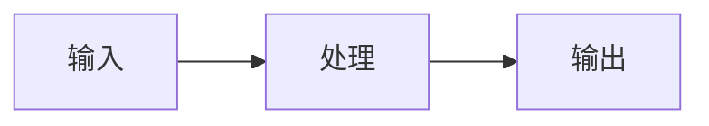

# 文章标题

## 概述

> 一句话总结本文内容，帮助读者快速了解本文讲什么。

本文介绍 [主题] 的基本概念、核心原理和学习路径。

---

## 一、什么是 [X]

用一段话简单定义，不要太学术化，用通俗易懂的语言解释。

## 二、核心概念

### 2.1 概念一

解释要点...

### 2.2 概念二

解释要点...

## 三、工作原理

一句话讲清楚它是怎么工作的：

## 四、常见应用场景

- 场景一：XXX
- 场景二：XXX
- 场景三：XXX

## 五、学习路线/技术演进

| 阶段 | 关键技术 | 时间 | 特点 |
|:---:|:---:|:---:|:---|
| 早期 | XXX | XXXX | XXX |
| 中期 | XXX | XXXX | XXX |
| 现在 | XXX | XXXX | XXX |

## 六、常见问题

**Q:** XXX？  
**A:** XXX。

**Q:** XXX？  
**A:** XXX。

## 七、总结

本文要点总结：

1. 要点一
2. 要点二
3. 要点三

---

## 参考资料

- [链接文字](URL)
- [链接文字](URL)