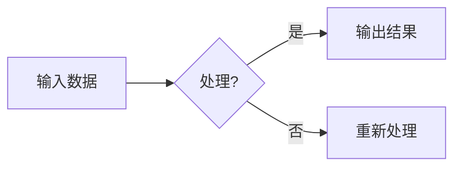
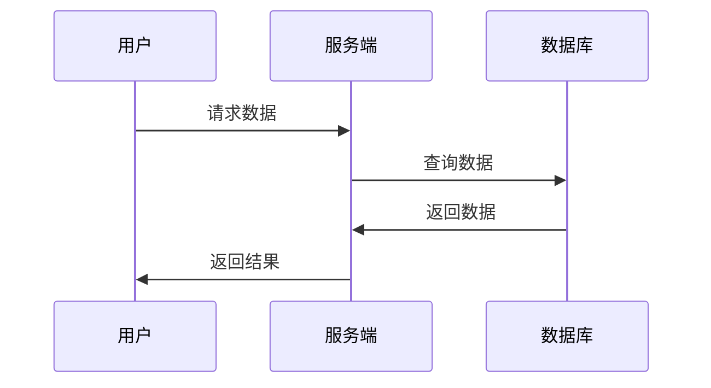

# VitePress Markdown 格式参考

## 标题

```markdown
# 一级标题（页面标题）
## 二级标题（章节）
### 三级标题（小节）
#### 四级标题（子项）
```

## 文字格式

**粗体**  *斜体*  ~~删除线~~  `行内代码`

> 块引用

这是[链接文字](https://example.com)

## 列表

### 无序列表

- 项目一
- 项目二
  - 子项目 A
  - 子项目 B
- 项目三

### 有序列表

1. 第一步
2. 第二步
3. 第三步

### 任务列表

- [x] 已完成任务
- [ ] 未完成任务

## 代码块

```python
def hello(name):
    print(f"Hello, {name}!")
    return name
```

**带行号高亮**

```python {1,3-4}
def fib(n):
    if n <= 1:
        return n
    return fib(n - 1) + fib(n - 2)
```

## 表格

| 列一 | 列二 | 列三 | 对齐说明 |
|:--- |:---: |---: |:--- |
| 内容 | 内容 | 内容 | 默认左对齐 |
| 内容 | 内容 | 内容 | `:---` 左对齐 |
| 内容 | 内容 | 内容 | `:---:` 居中 |
| 内容 | 内容 | 内容 | `---:` 右对齐 |

## 自定义容器

::: tip 提示
这是一个提示信息
:::

::: warning 注意
这是一个警告信息
:::

::: danger 警告
这是一个危险警告
:::

::: details 点击展开详情
这里是更多内容...

可以放多行内容
:::

## Mermaid 流程图



## Mermaid 时序图



## 图片


## 徽章（可以放参考链接）

- [GitHub](https://github.com) `<Badge type="tip" text="GitHub" />`
- [文档](https://vitepress.dev) `<Badge type="info" text="文档" />`
- [稳定](https://vitepress.dev) `<Badge type="warning" text="稳定" />`
- [实验性](https://vitepress.dev) `<Badge type="danger" text="实验性" />`

## 代码组

::: code-group

```js [main.js]
console.log('Hello')
```

```python [main.py]
print('Hello')
```

:::

## 水平线

---

## 脚注

这里有一个脚注引用[^1]

[^1]: 这是脚注内容

## LaTeX 公式

行内公式 $E = mc^2$

块级公式：

$$
\frac{1}{n-1} \sum_{i=1}^n (x_i - \bar{x})(y_i - \bar{y})
$$
